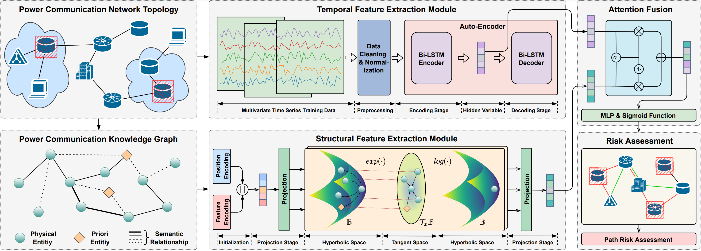

# Risk Assessment for Power Communication Network based on Topological Correlation of Multivariate Spatio-Temporal Data

## Introduction

This project focuses on assessing the risk of nodes in a power communication network based on the topological
correlation of multivariate spatiotemporal data.  
Below are the model illustration:

  
Figure 1: Risk assessment method based on topological correlation of multivariate spatiotemporal data.

## Dataset

The dataset used in this project includes:

- **Power Communication Network Structure**: Heterogeneous network data that combines physical and logical nodes.
- **SpatioTemporal Data**: Time series data describing the attributes of nodes across multiple dimensions.

For access to the dataset, please contact us or refer to the instructions in the `data/` folder.

## Environment Requirement

The project requires the following environment:

- **Python Version**: `>=3.8`
- **PyTorch Version**: `>=1.12`
- **Hardware**:
    - Recommended GPU: NVIDIA 3090 (24GB)
    - System memory: ≥64GB

## Performance Comparison

The following chart shows the performance comparison between our model (RAST) and baseline methods for risk prediction tasks:

|       Model        |    AUC     |    ACC     |     F1     |
|:------------------:|:----------:|:----------:|:----------:|
|        GCN         |   0.8609   |   0.7812   |   0.7949   |
|        GAT         |   0.8594   |   0.7815   |   0.7944   |
|     GraphSAGE      |   0.8627   |   0.7859   |   0.7957   |
|       IDEAL        |   0.8810   |   0.8040   |   0.8109   |
| PSO-Attention-LSTM |   0.8831   |   0.8075   |   0.8138   |
|        USAD        |   0.8837   |   0.8080   |   0.8141   |
|      **RAST**      | **0.9067** | **0.8322** | **0.8317** |